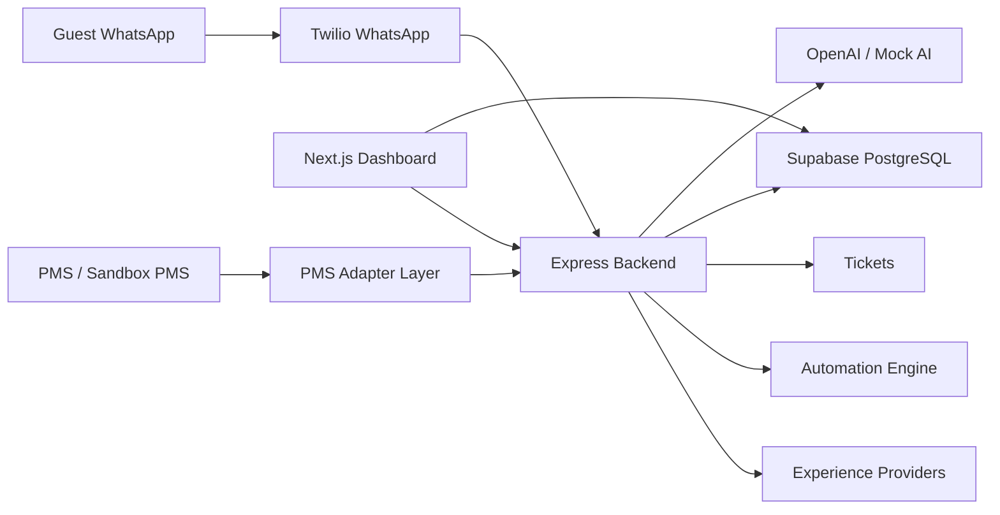
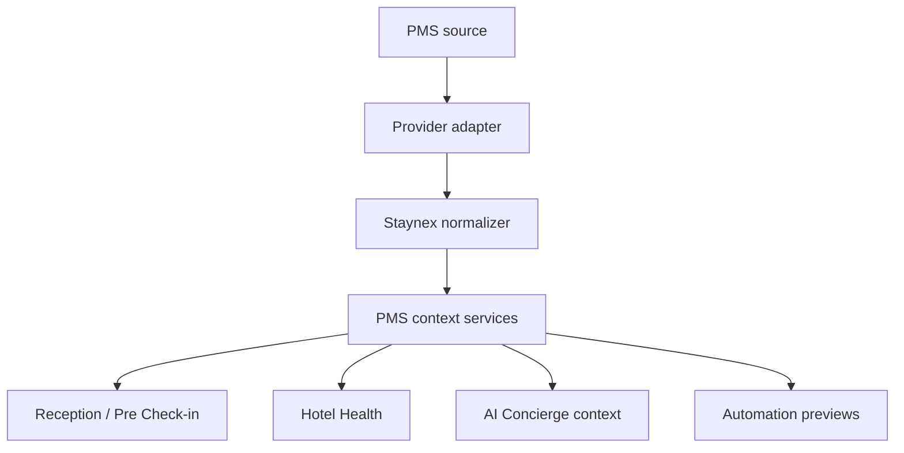
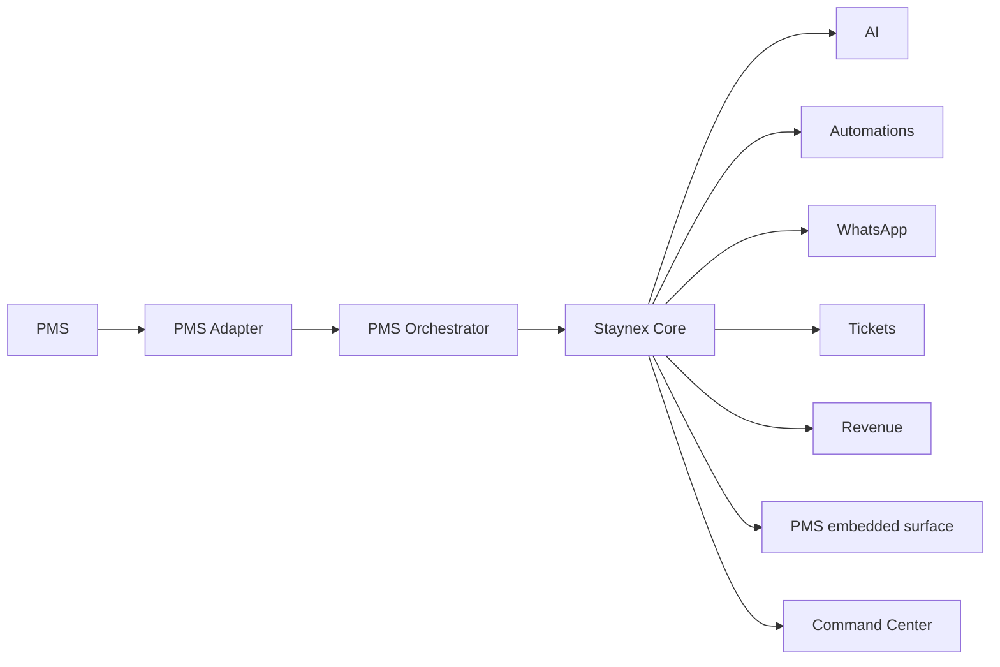

# Technical Architecture

Audit date: 2026-07-15

## High-Level Architecture

## Frontend

The dashboard is a Next.js App Router application under `dashboard/`.

Main areas:

- `/platform`: internal Staynex platform console.
- `/platform/hotels`: multi-hotel list and workspace entry.
- `/platform/providers`: provider and experience management.
- `/platform/monitoring`: internal observability.
- `/platform/ai-quality`: internal AI QA / Failure Intelligence.
- `/dashboard`: hotel workspace command center.
- `/dashboard/inbox`: guest conversations.
- `/dashboard/reception`: Reception / Pre Check-in.
- `/dashboard/automations`: automation center and test center.

UI stack:

- React 19.
- Next.js 15.
- Tailwind CSS.
- lucide-react icons.
- shared UI helpers in `dashboard/lib/ui/styles.js`.

## Backend

The backend is an Express application under `src/`.

Key areas:

- WhatsApp webhook and messaging routes.
- AI services and natural conversation logic.
- Tickets and escalation.
- Guest memory and guest intelligence.
- PMS intelligence and PMS read models.
- Automations and scheduled message jobs.
- Experience provider request flow.
- Google Sheets sync.

## Database

Supabase PostgreSQL is the primary data store. SQL files live under:

- `supabase/schema.sql`
- `supabase/sql/*.sql`

Important tables/migrations include hotels, hotel users, guests, conversations, tickets, reservations, PMS connections, scheduled messages, automation runs, provider experiences, experience booking requests, AI logs, guest intelligence and readiness/health tables.

## Authentication and Roles

The dashboard uses Supabase-related client/server helpers and local permission logic. Role and route permissions are defined in `dashboard/lib/permissions.js`.

Hotel roles include:

- owner/admin;
- manager;
- receptionist;
- housekeeping;
- maintenance;
- analyst.

Platform roles include:

- super_admin;
- platform_admin;
- internal_only;
- support.

## WhatsApp / Twilio

Twilio services exist in `src/services/twilio.service.js`. WhatsApp webhook routes are under `src/routes/whatsapp.routes.js` and related controllers.

Real sending depends on environment configuration and hotel setup. Test and automation sending are guarded by environment flags.

## AI / OpenAI

AI services include:

- OpenAI wrapper services.
- Concierge AI.
- Natural conversation.
- Failure Intelligence.
- Guest Intelligence.
- Revenue AI.
- Translation.
- Mock AI for safe local/test operation.

OpenAI should be described as configurable. The system can run with mock AI for tests and development.

## PMS Layer

The PMS layer is currently a read-oriented architecture with adapters, normalizers and sandbox/mock data. Files include:

- `src/services/pms/adapters/ubikos.adapter.js`
- `src/services/pms/normalizers/ubikos.normalizer.js`
- `src/services/pms/mocks/ubikos.mock.js`
- `src/integrations/pms/base-pms-connector.js`
- `src/integrations/pms/registry.js`
- provider connector placeholders and Apaleo-specific files.

## Current PMS Architecture

## Future PMS Orchestrator Architecture

This is planned evolution, not a fully completed current integration.

The future PMS Orchestrator should manage provider-specific auth, rate limits, health, mapping, sync state, event replay and unified hotel context.

## Automation Engine

Automations include:

- playbook definitions;
- trigger evaluation;
- priority;
- cooldowns;
- fatigue guard;
- deduplication;
- preview/dry-run;
- scheduled message queue;
- guest-facing copy separated from internal reasoning.

## Experience Providers

Providers and provider experiences are managed centrally from Platform. Hotels can be assigned providers. AI should use only provider experiences available for the active hotel.

Experience bookings represent guest-specific requests; experiences represent the catalog.

## Observability

Staynex has two levels:

- Hotel Health: simple operational state for hotels.
- Platform Monitoring: internal observability for Staynex.

AI Quality and Failure Intelligence are internal QA tools.

## Deploy

The repository is prepared for split deployment:

- backend from repository root, typically Railway or another Node host;
- dashboard from `dashboard/`, typically Vercel;
- Supabase for database/auth;
- Twilio, OpenAI, Resend and Google service account configured via environment variables.

