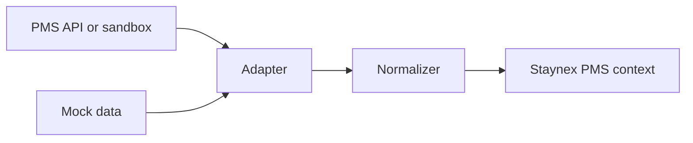

# PMS Integration

Audit date: 2026-07-15

## Current Model

Staynex treats PMS data as the operational source of truth. The current PMS integration approach is read-first and fail-closed.

Staynex should not invent PMS data. If PMS data is missing, low quality or unavailable, the UI and AI should show a safe fallback or skip the action.

## Read-Only Integration Principles

- Read reservations, guests, rooms, status, arrivals, departures and folios.
- Do not modify reservations.
- Do not perform check-in or check-out.
- Do not create PMS charges.
- Do not change room assignments.
- Do not scrape PMS UI.
- Fail closed when credentials, API docs or data quality are insufficient.

## Adapter / Normalizer / Mock Pattern



The adapter handles provider-specific access. The normalizer converts data into Staynex shapes. Mocks allow QA without touching a real PMS.

## Data Required From PMS

Staynex needs:

- reservations;
- guests;
- room numbers and room types;
- arrivals today;
- departures today;
- in-house guests;
- check-in/check-out status;
- room status;
- housekeeping status;
- maintenance/blocked room status;
- folios;
- charges;
- payments;
- outstanding balances;
- currency;
- reservation status;
- guest phone/language/country if available.

## Ubikos Status

Ubikos is currently Phase 1 safe preparation:

- adapter prepared;
- normalizers prepared;
- realistic mocks prepared;
- health check prepared;
- test script prepared;
- environment variables documented.

Ubikos is not connected to a live hotel. No official API credentials or confirmed endpoints are present in the repository.

## Ubikos Variables

The `.env.example` contains:

```env
UBIKOS_ENABLED=false
UBIKOS_SANDBOX=true
UBIKOS_READ_ONLY=true
UBIKOS_BASE_URL=https://cloud.ubikos.es
UBIKOS_API_BASE_URL=
UBIKOS_CLIENT_ID=
UBIKOS_CLIENT_SECRET=
UBIKOS_USERNAME=
UBIKOS_PASSWORD=
UBIKOS_HOTEL_ID=
UBIKOS_TIMEOUT_MS=15000
```

No real credentials should be committed.

## What We Need From Ubikos

Before live integration:

- official API documentation;
- authentication method;
- base API URL;
- sandbox/demo access;
- hotel/property ID format;
- reservation endpoints;
- guest endpoints;
- room endpoints;
- folio/charge/payment endpoints;
- webhook capabilities;
- rate limits;
- error model;
- pagination model;
- data retention/GDPR guidance;
- confirmation of read-only permissions;
- confirmation whether an embedded integration is possible through widgets, panels, modules, deep links or iframe-like surfaces.

## Embedded PMS Surface

Embedding Staynex inside a PMS is a product direction, not a completed current integration. Feasibility depends on each PMS:

- whether custom modules are supported;
- whether iframe/widgets are allowed;
- whether SSO is available;
- whether deep links can pass reservation/hotel context;
- whether API permissions allow safe read-only context.

## Flow Expected For Real PMS

1. PMS connection configured by hotel/platform admin.
2. Health check validates credentials and read-only status.
3. Staynex reads reservations and operational context.
4. Data is normalized.
5. Reception, Hotel Health, AI Concierge and Automations use the context.
6. If PMS data is missing or unsafe, Staynex skips risky actions.

