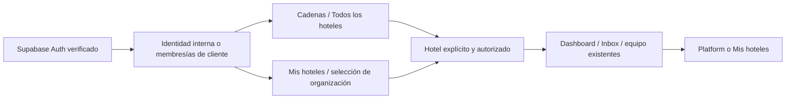

# Organizaciones y hoteles: primera versión local

El cierre del 18 de septiembre, la prueba del build real, las correcciones de texto y el procedimiento detallado están en [organization-publication-readiness.md](organization-publication-readiness.md). El resultado del 17 de septiembre que aparece al final se conserva como evidencia histórica.

Base de trabajo: `c3be26dc190308ea399f2143dc8a00430c957b44`, en la rama local `codex/organization-hotel-access`. Su árbol inicial coincide con `79da26e315072c9878dcb57df892b42b171064f9`, el main identificado en el diagnóstico anterior. No se han consultado ni modificado datos remotos durante esta implementación. El inventario privado preexistente queda fuera de Git.

## Comportamiento y permisos

| Perfil | Ámbito | Entrada y operación | Gestión |
|---|---|---|---|
| Staynex `super_admin` / `platform_admin` | Todas las organizaciones y hoteles | Cadenas o Todos los hoteles; identidad interna, rol operativo `admin`, apertura auditada | Organizaciones, incorporación, membresías y administración hotelaria |
| Staynex `internal_only` | Acceso interno existente | Directorios y operación interna según la política actual | No administra organizaciones en esta versión |
| Soporte | Política interna de lectura existente | Rol operativo `analyst`; sin mutaciones hotelarias | Sin gestión de organizaciones ni equipos |
| Administrador de cadena | Organización activa y concesiones hotelarias activas | Mis hoteles; `admin` por concesión explícita en cada hotel | Equipos de esos hoteles; sin roles internos, altas de hoteles ni administración de organizaciones |
| Dirección `admin` | Hoteles asignados y membresía activa | Dashboard y demás rutas existentes | Gestión hotelaria y de equipo actual |
| `manager` existente | Sus asignaciones | Permisos existentes; no se promueve | Sin nuevas capacidades de equipo |
| Recepción y otros roles existentes | Sus asignaciones | Primera ruta permitida; permisos propios de cada hotel | Sin elevación de permisos |

La cadena y el independiente usan el mismo modelo. `kind=independent` admite un hotel. No hay marcas, regiones, nuevo PMS ni un segundo Dashboard/Inbox.

Un identificador explícito ajeno produce una denegación, también si procede de URL, cabecera o selección persistida. Solo la ausencia de selección permite elegir automáticamente. Una persona puede ser `admin` en A y `manager` o recepción en B. El permiso de una asignación no se traslada a otra.

## Datos y concesiones

`supabase/sql/add_organizations.sql` añade `organizations`, `organization_users`, `hotels.organization_id` y el origen de concesión en `hotel_users`. No incorpora hoteles reales ni añade ejemplos a la base de la aplicación.

Las concesiones derivadas son filas separadas de `hotel_users`, con `organization_user_id`. Se mantienen los UUID, roles y datos de las asignaciones independientes. Por ello los índices antiguos de unicidad usuario/hotel y correo/hotel se sustituyen por índices parciales para asignaciones independientes y por unicidad membresía/hotel para las derivadas. Esta convivencia de filas es una incompatibilidad deliberada con consumidores antiguos que supongan una sola fila física por usuario/hotel.

`staynex_manage_organization` verifica al actor interno, bloquea la organización y ejecuta la operación y su auditoría en una transacción. `staynex_sync_organization_grants` crea, retira y restaura concesiones de forma idempotente. También se ejecuta al cambiar membresías, estado de organización o incorporar un hotel. Una suspensión manual no lleva la marca de revocación de cadena y no se restaura al reconciliar ni al retirar y devolver el rol.

Revocar el rol de cadena, conservando membresía ordinaria activa, deja disponibles únicamente las asignaciones independientes válidas. Revocar la membresía o suspender la organización bloquea todo su ámbito, aunque subsistan filas hotelarias con estado activo. No se borran evidencias de concesión.

Las invitaciones se vinculan por correo **verificado** de Supabase Auth. Después manda `user_id`; un correo coincidente de otra identidad no concede acceso. Las identidades ya vinculadas son inmutables. El cambio de correo de una cuenta vinculada necesita un procedimiento específico de reconciliación, no una nueva identidad inferida.

## Autorización y consultas

- `shared/access/organization-scope.js`: selección de asignaciones efectivas y comprobación conjunta de identidad, membresía, organización y asignación.
- `dashboard/lib/user-invitations.js` y `current-hotel.js`: resolución operativa central, sin sustitución silenciosa ni recuperación por errores de esquema. La compatibilidad se limita a hoteles con `organization_id IS NULL` y asignaciones independientes activas vinculadas.
- `dashboard/lib/organization-access.js`: directorio e indicadores con filtros de organización y hoteles autorizados **antes** de consultar/paginar/agregar. No usa el resumen global de Platform para clientes. No devuelve filas de huéspedes, credenciales ni conjuntos `raw`.
- Los indicadores «Usuarios» y «Accesos a hoteles» distinguen personas únicas y asignaciones operativas activas, con la explicación «Una persona puede tener acceso a varios hoteles». Una concesión y una asignación independiente son dos asignaciones, una persona. Los tickets abiertos conservan los estados `open` / `in_progress`; urgentes añade `priority=urgent`.
- Una cadena puede ver la ficha de un hotel incorporado con acceso operativo suspendido, pero el botón queda desactivado y sus datos operativos no entran en las consultas del usuario suspendido.
- `/api/settings/users` limita cambios a la fila del hotel autorizado, independiente y sin rol interno; el cuerpo no controla hotel, origen ni permisos internos. Las concesiones se muestran protegidas. Platform permite suspender una concesión, pero no cambiar su identidad o convertirla en invitación desde la gestión hotelaria.
- Los helpers RLS mantienen sus firmas. Guardas restrictivas añaden la condición de ámbito sobre las políticas existentes; no conceden permisos directos nuevos ni cambian las publicaciones de Realtime. Las tablas de organizaciones y sus mutaciones quedan detrás del servidor/RPC. La identidad no puede editarse directamente como `authenticated` o `anon`. Un trigger con derechos del invocante impide cambiar `hotels.organization_id` directamente incluso si existe una política antigua de escritura; conserva la edición de los demás campos autorizados y permite el contrato interno de incorporación.
- Las entradas internas mediante selección y carga de contexto exigen auditoría persistida. No se suplanta al cliente ni se muestra una sesión de soporte ficticia como si fuera la identidad efectiva.

## Interfaz y cambios de contexto

`OrganizationDirectoryClient` proporciona Cadenas y Mis hoteles. Staynex puede crear organizaciones, incorporar un UUID existente e invitar, cambiar o revocar una membresía. La gestión de equipos sigue siendo por hotel.

`AppShell` identifica organización, hotel y rol efectivo, y enlaza al directorio apropiado. Las rutas de directorio resuelven su propia autorización sin exigir un hotel previamente seleccionado. El contenedor del directorio permite desplazamiento vertical también en móvil.

Una selección valida primero el hotel en el servidor. Durante el cambio se retira la vista anterior. Se invalida cualquier resolución de contexto anterior y se abre un documento nuevo con `hotelId` explícito; esto descarta estado de componentes, suscripciones y solicitudes del documento previo. Además se conserva la comprobación de tenant de los payloads operativos. Una respuesta de selección cuyo hotel no coincida con lo solicitado no se persiste.

## Transición propuesta, pendiente de publicación

1. Confirmar el proyecto objetivo y ejecutar **solo en la futura publicación autorizada** `preflight_organizations.sql`. Revisar tipos, índices, políticas y prerrequisitos. No inferir ni cambiar objetos incompatibles por nombre. Conservar resultados e identidades en el espacio privado, fuera de Git.
2. Resolver antes de aplicar el esquema cualquier asignación activa sin `user_id`: requiere correspondencia verificada con Auth. La migración aborta si existe alguna; no pierde su acceso silenciosamente ni la convierte por correo en personal interno. Las asignaciones sin correo necesitan mapeo explícito antes de incorporar su hotel. Revisar unicidades personalizadas y colisiones de correo/identidad.
3. Conservar respaldo privado y mantener `SEND_AUTOMATIONS=false` y los flags actuales. Pausar temporalmente las escrituras de identidad y las incorporaciones durante la transición. Esta documentación no ejecuta ninguna pausa.
4. Aplicar `add_organizations.sql`, después de los contratos existentes de usuarios, auditoría y RLS fase 2. La migración es de esquema; todos los hoteles permanecen sin organización. No ejecutar asignaciones reales todavía. La compatibilidad acotada conserva los clientes vinculados existentes.
5. Publicar el código nuevo y verificar todas las instancias/rutas de identidad y consumidores de `hotel_users`. No crear concesiones derivadas durante convivencia con versiones que dependan de los índices antiguos o ignoren membresías.
6. Incorporar organizaciones/hoteles según un mapa aprobado **por UUID**, separado del esquema. La transacción crea membresías ordinarias para los accesos independientes existentes, conserva roles y aborta si encuentra una membresía incompatible; no la reactiva. Nadie se convierte automáticamente en administrador de cadena.
7. Conceder administradores mediante la acción `member`, verificar filas derivadas/auditoría, probar con sesiones reales y retirar la pausa de gestión cuando todas las instancias sean nuevas. No cambiar integraciones, proveedores, automatizaciones ni demo.

La incorporación repetida al mismo ámbito es idempotente. El traslado de un hotel entre organizaciones ya incorporadas queda expresamente bloqueado: necesita un procedimiento futuro que evalúe asignaciones, datos y revocaciones.

### Recuperación

No volver directamente a consumidores antiguos después de incorporar hoteles o crear concesiones: ignorarían las revocaciones de organización y podrían interpretar mal filas duplicadas. Ante un error, mantener el contrato nuevo y pausar solo la gestión afectada; corregir hacia delante con los datos y auditoría conservados. Suspender una organización revoca su ámbito cliente sin borrar asignaciones. No usar esta medida sobre producción sin la autorización de publicación correspondiente.

Si el esquema aún no tiene incorporaciones ni concesiones, evaluar catálogo y datos antes de cualquier retirada. No se incluye un rollback destructivo ni un borrado automático de filas para reconstruir índices antiguos.

### Información concreta pendiente

- Catálogo remoto actual y unicidades/políticas compatibles, incluidas identidades activas sin vincular.
- Mapa aprobado organización → UUID de hoteles; tipo cadena/independiente; cuentas verificadas que recibirán administración.
- Confirmación de todas las instancias nuevas antes de incorporar el primer hotel, y sesiones reales por perfil para validar Auth/PostgREST/Realtime tras publicar.

Estas dependencias no se han sustituido por suposiciones sobre nombres, marcas o dominios.

## Pruebas y laboratorio

`npm run ci:critical`, `npm run ci:postgres` y `npm run ci:dashboard` usan el aislamiento existente, sin `.env` privados ni proveedores. Las pruebas nuevas están en el job Critical (`test:organization-access`, además de post-login) y en el job PostgreSQL (`test:organization-postgres`), junto a Knowledge y exclusión de automatizaciones.

El job Dashboard ejecuta además `test:organization-production` después del build. Inicia `next start` y usa los handlers reales, sustituyendo únicamente el transporte Auth/PostgREST por un servidor HTTP local. Comprueba la ausencia del laboratorio, manipulación de contexto, alcance, escrituras y revocación con la misma sesión. No acredita una sesión Auth remota. PostgreSQL incluye ahora 22 escenarios y la comprobación del preflight READ ONLY antes/después de migrar.

Los escenarios PostgreSQL reproducen dos cadenas y un independiente, conservación de UUID/roles, nuevas incorporaciones y repetición, concesiones separadas, suspensión manual, revocación de rol/membresía/organización, invitaciones, identificadores ajenos, escritura directa de identidades y RLS. Las pruebas de servidor ejecutan el directorio y las acciones reales de gestión con adaptadores de datos, incluida paginación de más de mil tickets y rechazo de filas internas/derivadas/ajenas. Las regresiones existentes cubren recursos anidados, traducción, Inbox y controles de envío.

Laboratorio: `node scripts/local/organization-review.cjs`, en `http://127.0.0.1:3341`. Reutiliza el adaptador de sesión sintética existente de `.npm-cache/inbox-redesign/runtime/dashboard/lib/supabase-browser.js`; si falta, aborta expresamente. Copia las fuentes a `.npm-cache/organization-review/runtime`, sin modificar autenticación de producción. El manifiesto `/review-build.json` permite contrastar hashes de las fuentes servidas.

Perfiles disponibles en la barra amarilla:

| Perfil / URL | Comprobación |
|---|---|
| `/platform/organizations?profile=staynex` | Dos cadenas e independiente; selector de ámbito; formularios internos |
| `/my-hotels?profile=cadena` | Solo Aurora, dos hoteles como admin |
| `/my-hotels?profile=brisa` | Solo Brisa |
| `/my-hotels?profile=direccion` | Admin en Aurora Centro; manager en Aurora Mar |
| `/my-hotels?profile=recepcion` | Selección entre Aurora y Brisa; recepción en hoteles asignados |
| `/my-hotels?profile=independiente` | Solo Casa Olivo |

La revisión visual utiliza componentes reales y respuestas sintéticas claramente identificadas. No acredita Auth remoto ni persistencia de acciones desde el navegador: las mutaciones del laboratorio visual están bloqueadas y se prueban en servidor/PostgreSQL desechable. No se realizan envíos. Dashboard e Inbox mantienen las rutas y los componentes existentes; elegir SIMULADO permite ver mensajes sintéticos diferenciados por hotel.

Resultados y capturas de esta pasada: `.npm-cache/organization-review/evidence/`. El informe final de la tarea distingue los checks ejecutados, la revisión visual y cualquier limitación heredada; no presenta el laboratorio como una validación de producción.

## Resultado de la revisión local (17 de septiembre de 2026)

- `ci:critical`: PASS, incluidas autorización, gestión de equipo, selección explícita, respuesta tardía de otro hotel y paginación de más de 1.000 asignaciones/tickets.
- `ci:postgres`: PASS. El job ejecuta Knowledge, exclusión de automatizaciones y **21 escenarios de organizaciones**, sobre PostgreSQL 17.10 desechable y proveedores simulados. Incluye dos reconciliaciones concurrentes y denegación de incorporación directa bajo una política antigua permisiva.
- `ci:dashboard`: PASS tras los ajustes visuales y de retorno. `git diff --check`: PASS.
- Comprobación adicional heredada: `test-platform-management-academy-pms.js` falla en la aserción literal «All hotel systems operational.» de `HotelHealthClient.js`. Tanto la prueba como ese componente coinciden con la base; esta prueba no forma parte de los checks CI anteriores. No se ha cambiado texto de Salud para ocultar el fallo.

| Recorrido real de navegador | 1920 px | 1366 px | 390 px |
|---|---|---|---|
| Staynex / Cadenas | Revisado | Revisado | Revisado, desplazamiento hasta hoteles y gestión |
| Cadena / Mis hoteles | Revisado | Revisado | Revisado, ambos botones alcanzables |
| Hotel / Dashboard existente | Revisado | Revisado | Revisado; mensajes y servicios conservados |

Se corrigieron tres problemas observados: directorio móvil sin desplazamiento, solapamiento de la nueva barra de contexto con la cabecera del Dashboard y retorno interno que no restauraba la organización de la URL. La barra hotelaria se limita al espacio operativo, no al directorio global. No se observaron desbordamientos horizontales en las tres anchuras (ancho del documento igual al viewport). La barra de contexto y la cabecera ya no se superponen.

Se verificaron además: recepción con selector entre dos organizaciones → Brisa Norte → conversación sintética del mismo hotel; dirección con `admin` en Centro y `manager` en Mar; independiente con un único hotel; entrada desde Todos los hoteles con identidad Staynex y retorno a Platform conservando Brisa. No se enviaron respuestas ni se ejecutaron formularios de alta en el laboratorio. El navegador no acredita persistencia de auditoría ni autorización remota; estas garantías se contrastan en las pruebas locales de servidor y SQL.

Capturas del navegador, sin montaje ni edición, en `.npm-cache/organization-review/evidence/`:

- `staynex-1920.jpg`, `staynex-1366.jpg`, `staynex-390.jpg`.
- `cadena-1920.jpg`, `cadena-1366.jpg`, `cadena-390.jpg`, `cadena-390-hoteles.jpg`.
- `hotel-1920.jpg`, `hotel-1366.jpg`, `hotel-390.jpg`.
- `recepcion-inbox-390.jpg`, `staynex-hotel-390.jpg`.

Los logs finales son `ci-critical-final.log`, `ci-postgres-final.log` y `ci-dashboard-final.log`. Se verificaron los hashes del manifiesto servido contra las fuentes locales antes de las capturas. Estos artefactos sintéticos permanecen en el directorio local ignorado; los inventarios y respaldos privados no entran en Git.
